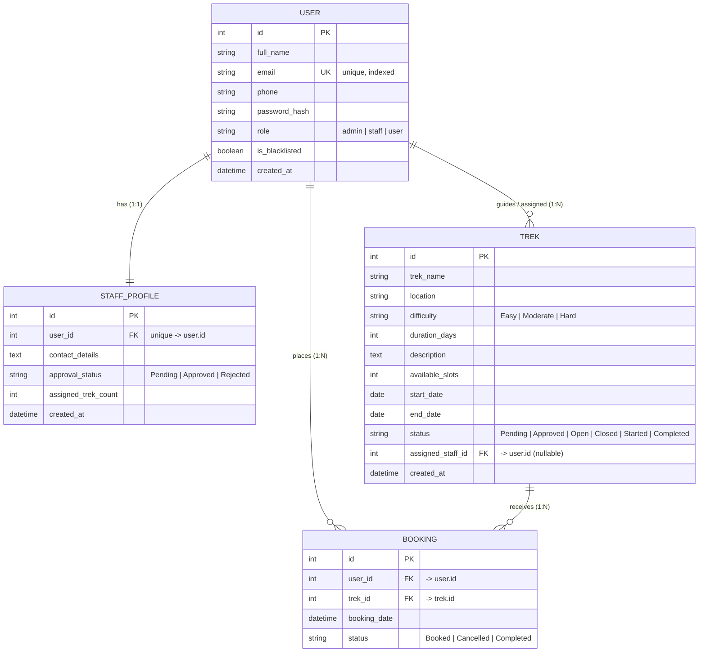

# 🏔️ TrekQuest — Trekking Management System

> A full-featured, role-based **Trekking Expedition Management** web application built with **Flask**, **SQLAlchemy**, and **Flask-Login**. TrekQuest lets administrators publish and manage treks, staff guides run their assigned expeditions, and trekkers discover and book adventures — all through clean, server-rendered dashboards.

<p align="left">
  
  
  
  
  
</p>

---

## 📑 Table of Contents

1. [Overview](#-overview)
2. [Key Features](#-key-features)
3. [Technology Stack](#-technology-stack)
4. [Project Structure](#-project-structure)
5. [Architecture & Request Flow](#-architecture--request-flow)
6. [Data Model & ER Diagram](#-data-model--er-diagram)
7. [Roles & Permissions](#-roles--permissions)
8. [Route Reference](#-route-reference)
9. [Core Workflows](#-core-workflows)
10. [Business Rules & Validation](#-business-rules--validation)
11. [Installation & Setup](#-installation--setup)
12. [Default Test Credentials](#-default-test-credentials)
13. [Configuration](#-configuration)
14. [Design System](#-design-system)
15. [Security Notes](#-security-notes)
16. [Troubleshooting](#-troubleshooting)
17. [Possible Extensions](#-possible-extensions)
18. [License](#-license)

---

## 🌄 Overview

TrekQuest is a monolithic Flask web application that models the complete lifecycle of a guided-trekking business. It was designed to be **easy to read, easy to run, and easy to demonstrate** — making it well-suited for academic submissions, viva-voce examinations, and as a learning reference for the classic Flask + SQLAlchemy + Flask-Login stack.

The application is built around **three user roles** that interact through dedicated portals:

| Role | Purpose |
|------|---------|
| 👑 **Admin** | Publishes treks, approves staff, manages users, and monitors bookings/analytics. |
| 🧭 **Staff (Guide)** | Runs the treks assigned to them — opening/closing bookings, adjusting slots, and viewing participants. |
| 🥾 **User (Trekker)** | Explores open treks, books a slot, manages their bookings, and edits their profile. |

Everything is **server-side rendered** with Jinja2 templates — there is no separate frontend framework or REST API layer, which keeps the mental model simple and the whole app runnable with a single `python app.py`.

---

## ✨ Key Features

- **🔐 Role-Based Access Control** — Three distinct portals (Admin, Staff, User), each with its own navigation, dashboards, and route guards enforced on every request.
- **🛡️ Secure Authentication** — Session management via Flask-Login and salted password hashing via Werkzeug (`generate_password_hash` / `check_password_hash`). Plain-text passwords are never stored.
- **🚫 Blacklisting System** — Admins can blacklist any user or staff account. Blacklisted accounts are blocked at login **and** actively logged out mid-session (enforced in the Flask-Login `user_loader`).
- **✅ Staff Approval Workflow** — Staff self-register but land in a `Pending` state; they cannot log in or be assigned treks until an admin explicitly **Approves** (or **Rejects**) them.
- **🗺️ Full Trek CRUD** — Admins can create, read, update, delete, search, and filter treks by name/ID, difficulty, status, and location.
- **🎟️ Slot-Safe Booking Engine** — Real-time seat tracking with **overbooking protection** (slots can never go below zero) and automatic **seat restoration** when a booking is cancelled. Cancelled bookings can be re-activated instead of duplicated.
- **📋 Live Participant Roster** — Staff guides get a live attendance sheet of everyone booked on each of their expeditions.
- **🔄 Trek Lifecycle Management** — Staff move treks through `Open → Closed → Started → Completed`. Completing a trek automatically marks all active bookings as `Completed`.
- **📊 Analytics Dashboard** — The admin dashboard renders **Chart.js** visualizations: most popular treks (bar chart) and difficulty distribution (doughnut chart), plus at-a-glance stat cards.
- **🔎 Search & Filter Everywhere** — Treks, staff, users, and bookings all support search (by name or numeric ID) and contextual filtering.
- **📱 Responsive UI** — A polished Bootstrap 5 interface with a custom design system (indigo/emerald theme, glass effects, micro-animations) that works on mobile, tablet, and desktop.
- **🌱 One-Command Seeding** — `seed.py` bootstraps the database with realistic admins, staff, trekkers, treks, and bookings for instant demoing.

---

## 🧰 Technology Stack

| Layer | Technology | Notes |
|-------|-----------|-------|
| **Language** | Python 3.8+ | Developed/tested on Python 3.13 |
| **Web Framework** | [Flask](https://flask.palletsprojects.com/) `>=3.0.0` | Routing, request handling, templating |
| **ORM** | [Flask-SQLAlchemy](https://flask-sqlalchemy.palletsprojects.com/) `>=3.1.0` | Declarative models & relationships |
| **Auth / Sessions** | [Flask-Login](https://flask-login.readthedocs.io/) `>=0.6.3` | Session management, `@login_required` |
| **Password Hashing** | Werkzeug Security | Ships with Flask |
| **Database** | SQLite | File-based, zero-config (`database/trekking.db`) |
| **Templating** | Jinja2 | Server-side rendering |
| **CSS Framework** | Bootstrap 5.3 (CDN) | Layout & components |
| **Icons** | Bootstrap Icons 1.10 (CDN) | UI iconography |
| **Charts** | Chart.js (CDN) | Admin analytics |
| **Fonts** | Google Fonts — *Outfit* | Typography |

---

## 📁 Project Structure

```
trekking_management/
├── app.py                  # Application entry point + ALL route handlers
├── config.py               # Configuration (secret key, DB URI, paths)
├── models.py               # SQLAlchemy models: User, StaffProfile, Trek, Booking
├── seed.py                 # Database seeder with sample data
├── requirements.txt        # Python dependencies
├── README.md               # This file
│
├── database/
│   └── trekking.db         # SQLite database (auto-created on first run)
│
├── static/
│   └── css/
│       └── styles.css      # Custom design system (CSS variables, animations)
│
└── templates/
    ├── base.html           # Master layout (navbar, flash messages, footer)
    ├── index.html          # Public landing page
    ├── login.html          # Unified login for all roles
    ├── register_user.html  # Trekker registration
    ├── register_staff.html # Staff/guide registration
    │
    ├── admin/
    │   ├── dashboard.html   # Stats + Chart.js analytics
    │   ├── treks.html       # Trek list / search / filter
    │   ├── trek_form.html   # Create & edit trek (shared form)
    │   ├── staff.html       # Staff approval & blacklist directory
    │   ├── users.html       # Trekker management
    │   └── bookings.html    # Global bookings ledger
    │
    ├── staff/
    │   ├── dashboard.html    # Assigned treks + lifecycle controls
    │   └── participants.html # Live roster for a trek
    │
    └── user/
        ├── dashboard.html    # Explore/search open treks
        ├── trek_details.html # Trek detail + booking action
        ├── my_bookings.html  # A trekker's bookings
        └── edit_profile.html # Profile editor
```

---

## 🏗️ Architecture & Request Flow

TrekQuest follows a straightforward **MVC-style monolith**:

- **Model** → `models.py` (SQLAlchemy declarative models)
- **View** → `templates/` (Jinja2 templates rendered server-side)
- **Controller** → `app.py` (route handlers containing business logic)

A typical authenticated request travels like this:

```
Browser
  │  HTTP request (e.g. POST /trek/3/book)
  ▼
Flask Router (app.py)
  │  1. @login_required  ──► Flask-Login checks the session cookie
  │  2. user_loader      ──► loads User; returns None if blacklisted (auto-logout)
  │  3. role guard       ──► if current_user.role != 'user': redirect
  ▼
Route Handler
  │  4. Business rules   ──► trek open? slots > 0? already booked?
  │  5. ORM operations   ──► db.session.add / update / commit
  ▼
Jinja2 Template  ──►  Rendered HTML  ──►  Browser
       │
       └── Flash messages surfaced via base.html
```

Key cross-cutting mechanisms:

- **`@login_manager.user_loader`** — Loads the current user on every request and **returns `None` for blacklisted accounts**, which instantly invalidates their active session.
- **Role guards** — Every protected handler begins with an explicit `if current_user.role != '<role>'` check that flashes an error and redirects, so authorization is enforced at the route level.
- **Flash messaging** — All user feedback (`success`, `danger`, `warning`, `info`) is flashed and rendered globally in `base.html` with dismissible, icon-decorated alerts.

---

## 🗃️ Data Model & ER Diagram

The schema consists of **four tables**. `User` is the central entity; `StaffProfile` extends staff users (1:1), while `Trek` and `Booking` capture expeditions and reservations.



### Table Details

#### `User`
The unified account table for all three roles, discriminated by the `role` column.

| Column | Type | Constraints | Description |
|--------|------|-------------|-------------|
| `id` | Integer | PK | Unique identifier |
| `full_name` | String(100) | NOT NULL | Display name |
| `email` | String(120) | UNIQUE, NOT NULL, INDEXED | Login identifier |
| `phone` | String(15) | NOT NULL | Contact number |
| `password_hash` | String(256) | NOT NULL | Werkzeug hash (never plain text) |
| `role` | String(20) | NOT NULL, default `user` | `admin`, `staff`, or `user` |
| `is_blacklisted` | Boolean | NOT NULL, default `False` | Blocks login & booking |
| `created_at` | DateTime | NOT NULL, default now (UTC) | Registration timestamp |

**Relationships:** `bookings` (1:N, cascade delete), `staff_profile` (1:1, cascade delete), `assigned_treks` (backref from `Trek`).

#### `StaffProfile`
Extended attributes for staff users only (one-to-one with `User`).

| Column | Type | Constraints | Description |
|--------|------|-------------|-------------|
| `id` | Integer | PK | Unique identifier |
| `user_id` | Integer | FK → `user.id`, UNIQUE | Owning staff user |
| `contact_details` | Text | Nullable | Bio / credentials |
| `approval_status` | String(20) | NOT NULL, default `Pending` | `Pending`, `Approved`, `Rejected` |
| `assigned_trek_count` | Integer | NOT NULL, default `0` | Cached count of assigned treks |
| `created_at` | DateTime | NOT NULL, default now (UTC) | Application timestamp |

#### `Trek`
An expedition offering.

| Column | Type | Constraints | Description |
|--------|------|-------------|-------------|
| `id` | Integer | PK | Unique identifier |
| `trek_name` | String(150) | NOT NULL | Name of the trek |
| `location` | String(100) | NOT NULL | Region / destination |
| `difficulty` | String(20) | NOT NULL | `Easy`, `Moderate`, `Hard` |
| `duration_days` | Integer | NOT NULL | Length in days (> 0) |
| `description` | Text | Nullable | Long-form details |
| `available_slots` | Integer | NOT NULL | Remaining seats (≥ 0) |
| `start_date` | Date | NOT NULL | Expedition start |
| `end_date` | Date | NOT NULL | Expedition end (≥ start) |
| `status` | String(20) | NOT NULL, default `Pending` | Lifecycle state |
| `assigned_staff_id` | Integer | FK → `user.id`, Nullable | Guide running the trek |
| `created_at` | DateTime | NOT NULL, default now (UTC) | Creation timestamp |

#### `Booking`
A reservation joining a user to a trek.

| Column | Type | Constraints | Description |
|--------|------|-------------|-------------|
| `id` | Integer | PK | Unique identifier |
| `user_id` | Integer | FK → `user.id`, NOT NULL | The trekker |
| `trek_id` | Integer | FK → `trek.id`, NOT NULL | The trek |
| `booking_date` | DateTime | NOT NULL, default now (UTC) | Reservation time |
| `status` | String(20) | NOT NULL, default `Booked` | `Booked`, `Cancelled`, `Completed` |

---

## 👥 Roles & Permissions

| Capability | Admin | Staff (Approved) | User (Trekker) |
|-----------|:-----:|:----------------:|:--------------:|
| Log in | ✅ | ✅ (after approval) | ✅ |
| Create / edit / delete treks | ✅ | ❌ | ❌ |
| Assign staff to treks | ✅ | ❌ | ❌ |
| Approve / reject staff | ✅ | ❌ | ❌ |
| Blacklist / unblacklist accounts | ✅ | ❌ | ❌ |
| View global bookings & analytics | ✅ | ❌ | ❌ |
| Open/close/start/complete a trek | ❌ | ✅ (own treks only) | ❌ |
| Adjust available slots | ❌ | ✅ (own treks only) | ❌ |
| View participant roster | ❌ | ✅ (own treks only) | ❌ |
| Explore & search open treks | — | — | ✅ |
| Book / cancel a trek | ❌ | ❌ | ✅ |
| Edit own profile | ❌ | ❌ | ✅ |

> **Note:** Admins cannot blacklist other admins. Staff can only ever act on treks where `assigned_staff_id == current_user.id`.

---

## 🧭 Route Reference

### Public / Auth Routes

| Method | Path | Handler | Description |
|--------|------|---------|-------------|
| `GET` | `/` | `index` | Public landing page |
| `GET/POST` | `/login` | `login` | Unified login; redirects to role dashboard |
| `GET/POST` | `/register/user` | `register_user` | Trekker sign-up |
| `GET/POST` | `/register/staff` | `register_staff` | Staff sign-up (starts `Pending`) |
| `GET` | `/logout` | `logout` | Ends the session |

### Admin Routes

| Method | Path | Handler | Description |
|--------|------|---------|-------------|
| `GET` | `/admin/dashboard` | `admin_dashboard` | Stats + Chart.js analytics |
| `GET` | `/admin/treks` | `manage_treks` | List/search/filter treks |
| `GET/POST` | `/admin/treks/create` | `create_trek` | Create a new trek |
| `GET/POST` | `/admin/treks/edit/<int:trek_id>` | `edit_trek` | Edit an existing trek |
| `POST` | `/admin/treks/delete/<int:trek_id>` | `delete_trek` | Delete a trek |
| `GET` | `/admin/staff` | `manage_staff` | Staff directory / approvals |
| `POST` | `/admin/staff/approve/<int:staff_id>` | `approve_staff` | Approve a guide |
| `POST` | `/admin/staff/reject/<int:staff_id>` | `reject_staff` | Reject a guide |
| `GET` | `/admin/users` | `manage_users` | Trekker directory |
| `POST` | `/admin/toggle-blacklist/<int:user_id>` | `toggle_blacklist_user` | Blacklist / unblacklist |
| `GET` | `/admin/bookings` | `view_bookings` | Global bookings ledger |
| `POST` | `/admin/bookings/cancel/<int:booking_id>` | `admin_cancel_booking` | Cancel any booking |

### Staff Routes

| Method | Path | Handler | Description |
|--------|------|---------|-------------|
| `GET` | `/staff/dashboard` | `staff_dashboard` | Treks assigned to the guide |
| `POST` | `/staff/treks/<int:trek_id>/update-slots` | `staff_update_slots` | Adjust available seats |
| `POST` | `/staff/treks/<int:trek_id>/change-status/<action_name>` | `staff_change_status` | `open` / `close` / `start` / `complete` |
| `GET` | `/staff/treks/<int:trek_id>/participants` | `staff_trek_participants` | Live participant roster |

### User (Trekker) Routes

| Method | Path | Handler | Description |
|--------|------|---------|-------------|
| `GET` | `/explorer` | `user_dashboard` | Explore & search **Open** treks |
| `GET` | `/trek/<int:trek_id>` | `trek_details` | Trek detail sheet |
| `POST` | `/trek/<int:trek_id>/book` | `book_trek` | Reserve a slot |
| `POST` | `/booking/<int:booking_id>/cancel` | `cancel_booking` | Cancel own booking |
| `GET` | `/my-bookings` | `my_bookings` | Booking history |
| `GET/POST` | `/profile/edit` | `edit_profile` | Update profile info |

---

## 🔄 Core Workflows

### 1️⃣ Staff Onboarding & Approval
```
Staff self-registers (/register/staff)
        │  StaffProfile.approval_status = "Pending"
        ▼
Login blocked while Pending/Rejected
        │
Admin reviews in /admin/staff
        ├── Approve ──► status = "Approved" ──► staff can log in & be assigned treks
        └── Reject  ──► status = "Rejected" ──► login remains blocked
```

### 2️⃣ Trek Lifecycle
```
Admin creates trek ──► status: Pending / Approved
        │  (Admin assigns a guide)
        ▼
Staff opens bookings ──► Open      (visible to trekkers, bookable)
        │
Staff closes bookings ──► Closed   (no new bookings)
        │
Staff starts trek ──► Started
        │
Staff completes trek ──► Completed (all active bookings auto-marked Completed)
```
> Only **`Open`** treks appear in the trekker explorer and can be booked.

### 3️⃣ Booking & Cancellation
```
Trekker books an Open trek (/trek/<id>/book)
        │  Guards: trek Open? slots > 0? not blacklisted? not already booked?
        ▼
available_slots -= 1  &  Booking(status="Booked")
        │
Trekker (or Admin) cancels (/booking/<id>/cancel)
        │  Guard: trek still Open (users) — admins can override
        ▼
available_slots += 1  &  Booking.status = "Cancelled"
        │
Re-booking a Cancelled trek re-activates the SAME booking (no duplicate)
```

### 4️⃣ Blacklisting
```
Admin toggles blacklist (/admin/toggle-blacklist/<id>)
        │
is_blacklisted = True
        ▼
On next request, user_loader returns None ──► session invalidated (forced logout)
Login attempts & bookings are rejected with a flash message
```

---

## ✅ Business Rules & Validation

The application enforces a number of guardrails in `app.py`:

- **Overbooking protection** — Booking is refused when `available_slots <= 0`; slots are never allowed to go negative.
- **Seat restoration** — Cancelling a `Booked` reservation increments `available_slots` back by one.
- **No duplicate bookings** — An existing `Booked` record blocks re-booking; a `Cancelled` record is *reactivated* rather than duplicated.
- **Status gating** — Trekkers can only book `Open` treks and can only cancel while the trek is still `Open` (admins may cancel regardless).
- **Trek form validation** — On create/edit: duration must be **positive**, slots **non-negative**, dates are parsed strictly (`YYYY-MM-DD`), and `end_date` cannot precede `start_date`. Invalid input re-renders the form with a flash error.
- **Ownership checks** — Staff actions (slots, status, participants) verify the trek is assigned to the current staff member.
- **Assigned-count sync** — `StaffProfile.assigned_trek_count` is recomputed whenever treks are created, reassigned, or deleted.
- **Admin protection** — Admin accounts cannot be blacklisted by other admins.
- **Duplicate email prevention** — Registration and profile editing reject emails already in use.

---

## 🚀 Installation & Setup

### Prerequisites
- **Python 3.8+** (tested on 3.13)
- `pip` (bundled with Python)

### Step 1 — Enter the project directory
```bash
cd trekking_management
```

### Step 2 — (Recommended) Create & activate a virtual environment
```bash
python -m venv venv
```
Activate it:

- **Windows (PowerShell):**
  ```powershell
  venv\Scripts\Activate.ps1
  ```
- **Windows (Command Prompt):**
  ```cmd
  venv\Scripts\activate
  ```
- **macOS / Linux:**
  ```bash
  source venv/bin/activate
  ```

### Step 3 — Install dependencies
```bash
pip install -r requirements.txt
```

### Step 4 — Seed the database *(optional but recommended)*
Creates the schema and loads sample admins, staff, trekkers, treks, and bookings:
```bash
python seed.py
```

### Step 5 — Run the application
```bash
python app.py
```
On first run, `app.py` automatically creates any missing tables and a default admin account. Then open:

👉 **http://127.0.0.1:5000**

> The app runs in **debug mode** on `0.0.0.0:5000` by default. Do not use these settings in production (see [Security Notes](#-security-notes)).

---

## 🔑 Default Test Credentials

After running `seed.py` (or just `app.py`, which creates the admin), use these accounts:

| Role | Email | Password | Notes |
|------|-------|----------|-------|
| 👑 **Admin** | `ganesh.agarwal@pw.live` | `zxcvbnm1` | Auto-created on first launch |
| 🧭 **Approved Staff** | `john@trek.com` | `staff123` | Has treks assigned |
| ⏳ **Pending Staff** | `jane@trek.com` | `staff123` | Awaiting admin approval (cannot log in yet) |
| 🥾 **Active Trekker** | `alice@gmail.com` | `user123` | Has an active booking |
| 🥾 **Trekker** | `bob@gmail.com` | `user123` | Has a cancelled booking |
| 🚫 **Blacklisted Trekker** | `charlie@gmail.com` | `user123` | Blocked from login & booking |

> ⚠️ These are **demo credentials only** — change or remove them before deploying anywhere public.

---

## ⚙️ Configuration

Configuration lives in `config.py` via the `Config` class:

| Setting | Default | Description |
|---------|---------|-------------|
| `SECRET_KEY` | env `SECRET_KEY` → fallback `trek-secret-key-12345` | Signs session cookies |
| `SQLALCHEMY_DATABASE_URI` | `sqlite:///database/trekking.db` | Database location (auto-created) |
| `SQLALCHEMY_TRACK_MODIFICATIONS` | `False` | Disables event overhead |

**Override the secret key** (recommended) via an environment variable:

```bash
# macOS / Linux
export SECRET_KEY="a-long-random-secret"

# Windows PowerShell
$env:SECRET_KEY = "a-long-random-secret"
```

The `database/` directory is created automatically at import time if it does not exist.

---

## 🎨 Design System

The custom stylesheet (`static/css/styles.css`) defines a cohesive design language via CSS variables:

| Token | Value | Usage |
|-------|-------|-------|
| `--primary-color` | `#4f46e5` (Indigo) | Primary actions, links |
| `--accent-color` | `#10b981` (Emerald) | Success, highlights, brand |
| `--secondary-color` | `#0f172a` (Slate 900) | Navbar, headings |
| `--background-color` | `#f8fafc` (Slate 50) | Page background |
| `--border-radius` | `12px` | Rounded corners |
| `--transition` | `cubic-bezier(0.4, 0, 0.2, 1)` | Smooth micro-animations |

Design highlights:
- **Typography** — Google Fonts *Outfit* (300–700 weights).
- **Components** — Bootstrap 5 cards, badges, dropdowns, modals, and dismissible flash alerts.

- **Iconography** — Bootstrap Icons throughout (compass brand mark, status icons, action buttons).
- **Responsiveness** — Fluid layouts that adapt to mobile, tablet, and desktop.
- **Polish** — Card hover shadows, elevated stat tiles, and subtle transitions.

---

## 🔒 Security Notes

TrekQuest implements sensible defaults for a teaching/demo app, but the following should be addressed before any real deployment:

**Already handled:**
- ✅ Passwords are hashed with Werkzeug (never stored in plain text).
- ✅ Sessions are managed and signed by Flask-Login / Flask.
- ✅ Blacklisted accounts are actively logged out via `user_loader`.
- ✅ Every protected route enforces a role guard.
- ✅ Ownership checks prevent staff from touching others' treks.

**To harden for production:**
- 🔧 Set a strong, secret `SECRET_KEY` via environment variable (do not ship the default).
- 🔧 Turn off `debug=True` and run behind a production WSGI server (e.g. gunicorn/waitress) with HTTPS.
- 🔧 Add **CSRF protection** (e.g. Flask-WTF) — POST forms currently have no CSRF tokens.
- 🔧 Add server-side rate limiting on login/registration.
- 🔧 Consider DB-level transactions/locking for booking under high concurrency.
- 🔧 Migrate from SQLite to PostgreSQL/MySQL for multi-user production workloads.

---

## 🛠️ Troubleshooting

| Problem | Cause / Fix |
|---------|-------------|
| `ModuleNotFoundError: No module named 'flask'` | Dependencies not installed — run `pip install -r requirements.txt` (with your venv active). |
| Port `5000` already in use | Another process is bound to 5000. Stop it, or change the port in `app.py` (`app.run(..., port=5001)`). |
| Pending staff can't log in | Expected — an admin must **Approve** them in `/admin/staff` first. |
| Trek not visible to trekkers | Only treks with status **`Open`** appear in the explorer; ask staff/admin to open it. |
| Changes to data not appearing | Ensure you're editing the DB the app uses (`database/trekking.db`); re-run `seed.py` to reset sample data. |
| Want a clean database | Delete `database/trekking.db` and re-run `python seed.py`. |
| Blacklisted user stuck logged out | Intended behavior — an admin must unblacklist them via the toggle in `/admin/users`. |

---

## 🌟 Possible Extensions

Ideas for taking the project further:

- 📧 Email notifications (booking confirmations, approval alerts)
- 💳 Payment gateway integration for paid treks
- ⭐ Reviews & ratings for completed treks
- 🖼️ Trek image galleries / cover photos
- 📄 Pagination on large listings
- 🔁 Database migrations via Flask-Migrate (Alembic)
- 🧪 Automated test suite (pytest)
- 🌐 A REST/JSON API layer for a mobile client
- 📅 Calendar / availability views
- 🗺️ Map integration for trek locations

---

## 📜 License

This project was developed for **educational purposes** (college academic submission & viva-voce examination). Use, modify, and learn from it freely.

---

<p align="center">
  <strong>🏔️ TrekQuest</strong> — Built with Flask, SQLAlchemy & Flask-Login<br>
  <em>Adventure awaits. Book your next summit.</em>
</p>
